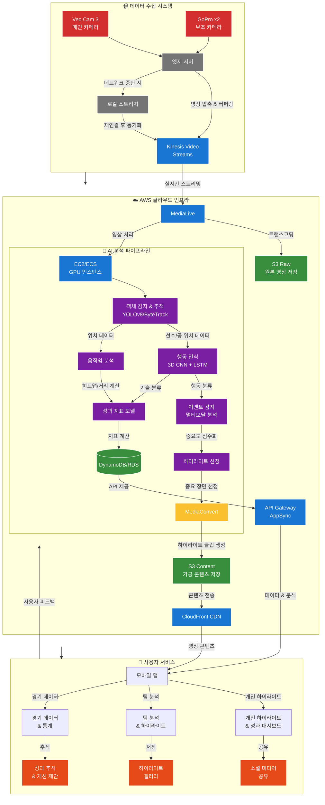
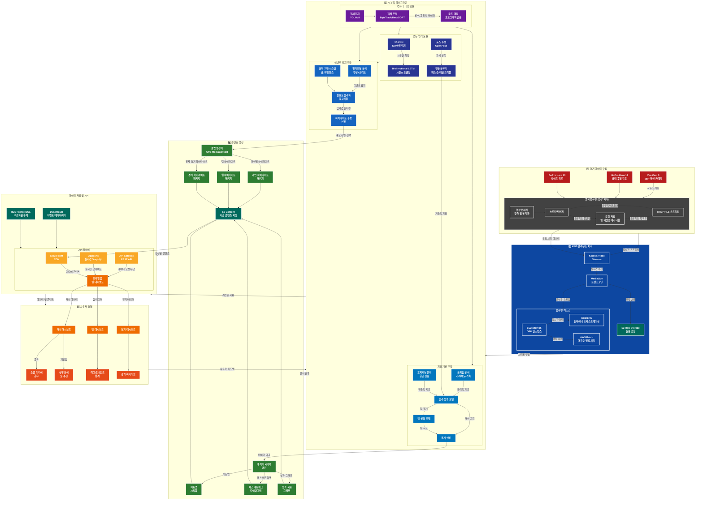
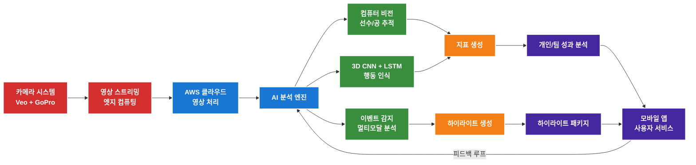
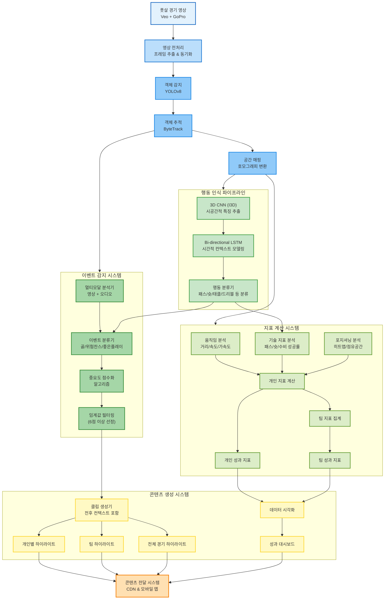

# ROKAF-Startup-Challenge-Every-futsal-

구성 계획:
1. 서비스 개요 - 간단한 소개
2. 시스템 작동 원리 - 단계별 설명
3. 핵심 기술 요소 설명
4. 사용자 경험 흐름
5. 기대 효과 및 비즈니스 가치

각 섹션은 간결하고 명확하게 작성하며, 비유나 예시를 활용해 이해하기 쉽게 만들겠습니다.

# 풋살 AI 분석 시스템: 경기부터 하이라이트까지

## 1. 한눈에 보는 서비스 개요

**풋살 AI 분석 시스템**은 아마추어 풋살 선수들에게 프로급 경기 분석과 개인 맞춤형 하이라이트를 제공하는 혁신적인 서비스입니다. 풋살장에 설치된 카메라가 경기를 촬영하고, AI가 자동으로 분석하여 개인 및 팀 하이라이트와 상세 지표를 제공합니다.

**주요 기능:**
- 📹 다각도 경기 촬영 (180° 메인 + 보조 앵글)
- 🎯 AI 기반 개인/팀 하이라이트 자동 생성
- 📊 20+ 개인 성과 지표 분석
- 📱 모바일 앱으로 언제 어디서나 접근

## 2. 어떻게 작동하나요? - 5단계 시스템 흐름

### 1️⃣ 경기 촬영 단계
- **스마트 카메라 시스템**이 경기장 전체를 커버
  - Veo Cam 3: 180° 메인 카메라 (AI 자동 트래킹)
  - GoPro x2: 골대 후방 및 사이드 앵글 (역동적 장면 캡처)
- **엣지 컴퓨팅 기술**로 현장에서 1차 처리
  - 영상 압축 및 실시간 스트리밍
  - 네트워크 불안정 시 자동 버퍼링 및 동기화

### 2️⃣ 클라우드 전송 단계
- **안전한 스트리밍 프로토콜**로 AWS 클라우드로 전송
- **멀티 소스 트랜스코딩**으로 다양한 각도 영상 동기화
- **고성능 GPU 서버**에서 실시간 처리 준비

### 3️⃣ AI 분석 단계
- **3D CNN + LSTM 기술**로 행동 및 이벤트 인식
  - 3D CNN: 영상의 공간적 특징 추출 (누가, 어디서, 무엇을)
  - LSTM: 시간적 컨텍스트 분석 (언제, 어떤 순서로, 얼마나 중요한지)
- **컴퓨터 비전 기술**로 선수와 공 추적
  - 선수별 움직임 패턴 분석
  - 실시간 위치 및 속도 측정
- **멀티모달 분석**으로 중요 순간 포착
  - 영상 + 오디오 통합 분석
  - 골, 슛, 패스 등 주요 이벤트 자동 감지

### 4️⃣ 콘텐츠 생성 단계
- **하이라이트 자동 생성**
  - 중요도 점수 기반 장면 선택 (골: 10점, 슛온골: 7점, 좋은 패스: 5점)
  - 이벤트 전후 컨텍스트 포함 클립 생성
  - 멀티앵글 자동 편집
- **개인 및 팀 지표 시각화**
  - 히트맵, 패스 네트워크, 성과 그래프 자동 생성
  - 직관적 인포그래픽으로 복잡한 데이터 시각화

### 5️⃣ 사용자 경험 단계
- **모바일 앱**으로 언제 어디서나 접근
  - 개인 대시보드: 나만의 경기 분석 및 하이라이트
  - 팀 대시보드: 팀 성과 및 전술 분석
- **소셜 공유 기능**으로 하이라이트 즉시 공유
- **성장 추적**으로 경기별 발전 과정 확인

## 3. 핵심 기술: "보이지 않는 코치" AI

### 하이라이트 감지 기술
**AI가 경기의 모든 순간을 지켜보며 중요한 장면을 자동으로 포착합니다**

![하이라이트 생성 프로세스]

1. **이벤트 감지**: 3D CNN + LSTM 모델이 골, 슛, 드리블 등 주요 액션 식별
2. **중요도 평가**: 각 이벤트에 점수 부여 (상황, 난이도, 희귀성 고려)
3. **컨텍스트 분석**: 단순 순간이 아닌 전후 맥락까지 고려
4. **최적 앵글 선택**: 여러 카메라 중 최적의 시청 각도 자동 선택
5. **하이라이트 제작**: 자연스러운 전환과 편집으로 완성도 높은 클립 생성

### 개인 성과 분석 기술
**AI가 선수 한 명 한 명을 세밀하게 분석하여 객관적인 성과 지표를 제공합니다**

1. **선수 식별 및 추적**: 유니폼 색상/번호로 선수 개별 추적
2. **움직임 분석**: 이동 거리, 스프린트, 가속 패턴 측정
3. **기술 분석**: 패스, 슛, 드리블 성공률 계산
4. **포지셔닝 분석**: 공간 점유 및 전술적 위치 평가
5. **종합 평가**: 다차원 지표를 통합한 성과 스코어 제공

### 팀 전술 분석 기술
**팀의 전체 움직임과 연결성을 분석하여 전술적 인사이트를 제공합니다**

1. **패스 네트워크**: 선수 간 연결 패턴 시각화
2. **압박 분석**: 수비 강도 및 효율성 측정
3. **공격 패턴**: 주요 공격 루트 및 전술 파악
4. **공간 활용**: 팀의 공간 점유 및 활용도 분석
5. **시간적 변화**: 체력 저하에 따른 전술 변화 감지

## 4. 실제 서비스 이용 흐름

### 예약부터 분석까지
1. **앱에서 풋살장 예약** - 날짜/시간 선택 및 팀원 등록
2. **경기 진행** - 설치된 카메라가 자동으로 녹화 시작
3. **실시간 알림** - 골 등 중요 이벤트 발생 시 앱으로 즉시 알림
4. **경기 후 분석** - 경기 종료 후 30분 내 기본 하이라이트 제공
5. **상세 분석** - 1시간 내 개인 및 팀 상세 분석 데이터 제공

### 앱 내 주요 화면
- **홈 대시보드**: 최근 경기 하이라이트 및 주요 지표 요약
- **내 하이라이트**: 개인별 베스트 플레이 모음
- **성과 분석**: 상세 지표 및 경기별 성장 트렌드
- **팀 분석**: 팀 전술 및 성과 분석 대시보드
- **경기 갤러리**: 전체 경기 아카이브 및 하이라이트

## 5. 기대 효과 및 차별점

### 사용자 가치
- **객관적 성장 피드백**: "느낌"이 아닌 데이터 기반 피드백
- **시간 절약**: 2시간 경기에서 핵심 장면만 3분으로 압축
- **모티베이션 증가**: 자신의 활약 장면 확인으로 동기부여
- **팀 전술 이해**: 전체 경기 흐름과 팀 전술 파악 용이

### 기술적 차별점
- **풋살 특화 AI**: 11인제 축구가 아닌 풋살에 최적화된 분석
- **멀티모달 분석**: 영상+오디오 통합 분석으로 정확도 향상
- **엣지-클라우드 하이브리드**: 현장 처리와 클라우드 분석 결합으로 안정성 확보
- **개인화 알고리즘**: 사용자 피드백 기반 지속적 개선

### 비즈니스 모델  ->수정필요
- **풋살장 월 구독**: 풋살장당 100-150만원/월
- **개인 구독**: 월 5천원 (프리미엄 분석 및 하이라이트)
- **경기당 결제**: 경기당 2만원 (기본 서비스)
- **확장 가능성**: 리그/대회 운영, 코칭 연계, 교육 콘텐츠

## 6. 구현 로드맵

**MVP 단계 (2-3개월)**
- 기본 카메라 설정 및 스트리밍 인프라
- 골/슛 기본 감지 및 하이라이트 생성
- 핵심 지표 5-7개 구현

**베타 서비스 (3-4개월)**
- 3D CNN + LSTM 모델 고도화
- 완전한 하이라이트 자동 생성
- 20+ 개인 지표 및 팀 분석 구현

**정식 서비스 (6개월)**
- 모든 기능 최적화 및 안정화
- 서울 주요 풋살장 10곳 시범 서비스
- 피드백 기반 지속적 개선

## 시스템 파이프라인

## 시스템 상세 파이프라인

## 시스템 핵심 프로세스 플로우

## 기술 상세 플로우

