# ROKAF-Startup-Challenge-Every-futsal-

구성 계획:
1. 서비스 개요 - 간단한 소개
2. 시스템 작동 원리 - 단계별 설명
3. 핵심 기술 요소 설명
4. 사용자 경험 흐름
5. 기대 효과 및 비즈니스 가치

각 섹션은 간결하고 명확하게 작성하며, 비유나 예시를 활용해 이해하기 쉽게 만들겠습니다.

# 풋살 AI 분석 시스템: 경기부터 하이라이트까지

## 1. 한눈에 보는 서비스 개요

**풋살 AI 분석 시스템**은 아마추어 풋살 선수들에게 프로급 경기 분석과 개인 맞춤형 하이라이트를 제공하는 혁신적인 서비스입니다. 풋살장에 설치된 카메라가 경기를 촬영하고, AI가 자동으로 분석하여 개인 및 팀 하이라이트와 상세 지표를 제공합니다.

**주요 기능:**
- 📹 다각도 경기 촬영 (180° 메인 + 보조 앵글)
- 🎯 AI 기반 개인/팀 하이라이트 자동 생성
- 📊 20+ 개인 성과 지표 분석
- 📱 모바일 앱으로 언제 어디서나 접근

## 2. 어떻게 작동하나요? - 5단계 시스템 흐름

### 1️⃣ 경기 촬영 단계
- **스마트 카메라 시스템**이 경기장 전체를 커버
  - Ptzoptic 4k move: 메인 카메라 (AI 자동 트래킹)
  - GoPro x2: 골대 후방 및 사이드 앵글 (역동적 장면 캡처)
- **엣지 컴퓨팅 기술**로 현장에서 1차 처리
  - 영상 압축 및 실시간 스트리밍
  - 네트워크 불안정 시 자동 버퍼링 및 동기화

### 2️⃣ 클라우드 전송 및 트래킹 단계
- **안전한 스트리밍 프로토콜**로 AWS 클라우드로 전송
- **멀티 소스 트랜스코딩**으로 다양한 각도 영상 동기화
- **고성능 GPU 서버**에서 실시간 처리 준비
  
- **실시간 AI 트래킹 파이프라인**
  - YOLOv8 객체 감지: 선수와 공을 30fps로 실시간 감지
  - DeepSORT 추적 알고리즘: 선수 ID 유지하며 지속 추적
  - 중요도 맵 생성: 공(50%), 주변 선수(30%), 활동 영역(20%) 가중치
- **지능형 PTZ 카메라 제어**
  - Kalman 필터: 공/선수 미래 위치 예측으로 지연시간 극복
  - 스무딩 알고리즘: 부드러운 카메라 움직임 보장
  - 상황 인식 줌 제어: 상황별 최적 앵글 자동 선택
    * 빠른 공격 전환: 넓은 앵글로 전체 조망
    * 골 찬스: 타이트한 줌으로 액션 강조
    * 코너킥/세트피스: 전술적 배치 포착 위한 적절한 줌
- **다중 경기장 동시 관리**
  - 경기장별 독립 인스턴스로 안정적 서비스
  - 자동 확장 시스템으로 동시 경기 증가에도 원활한 운영
  - 중앙 모니터링으로 모든 경기장 상태 실시간 관리

### 3️⃣ AI 분석 단계
- **컴퓨터 비전 기술**로 선수와 공 추적
  - 트래킹 시스템과 연동된 정밀한 위치 데이터 활용
  - 공간 매핑: 2D 화면 좌표를 실제 필드 좌표로 변환
  - 선수별 움직임 패턴 및 히트맵 생성
- **3D CNN + LSTM 기술**로 행동 및 이벤트 인식
  - 3D CNN: 영상의 공간적 특징 추출 (누가, 어디서, 무엇을)
  - LSTM: 시간적 컨텍스트 분석 (언제, 어떤 순서로, 얼마나 중요한지)
  - 행동 분류: 패스, 슛, 드리블, 태클 등 자동 인식
- **컴퓨터 비전 기술**로 선수와 공 추적
  - 선수별 움직임 패턴 분석
  - 실시간 위치 및 속도 측정
- **멀티모달 분석**으로 중요 순간 포착
  - 영상 + 오디오 통합 분석
  - 골, 슛, 패스 등 주요 이벤트 자동 감지

### 4️⃣ 콘텐츠 생성 단계
- **하이라이트 자동 생성**
  - 중요도 점수 기반 장면 선택 (골: 10점, 슛온골: 7점, 좋은 패스: 5점)
  - 이벤트 전후 컨텍스트 포함 클립 생성
  - 멀티앵글 자동 편집
- **개인 및 팀 지표 시각화**
  - 히트맵, 패스 네트워크, 성과 그래프 자동 생성
  - 직관적 인포그래픽으로 복잡한 데이터 시각화

### 5️⃣ 사용자 경험 단계
- **모바일 앱**으로 언제 어디서나 접근
  - 개인 대시보드: 나만의 경기 분석 및 하이라이트
  - 팀 대시보드: 팀 성과 및 전술 분석
- **소셜 공유 기능**으로 하이라이트 즉시 공유
- **성장 추적**으로 경기별 발전 과정 확인

## 3. 핵심 기술: "보이지 않는 코치" AI

### 하이라이트 감지 기술
**AI가 경기의 모든 순간을 지켜보며 중요한 장면을 자동으로 포착합니다**

![하이라이트 생성 프로세스]

1. **이벤트 감지**: 3D CNN + LSTM 모델이 골, 슛, 드리블 등 주요 액션 식별
2. **중요도 평가**: 각 이벤트에 점수 부여 (상황, 난이도, 희귀성 고려)
3. **컨텍스트 분석**: 단순 순간이 아닌 전후 맥락까지 고려
4. **최적 앵글 선택**: 여러 카메라 중 최적의 시청 각도 자동 선택
5. **하이라이트 제작**: 자연스러운 전환과 편집으로 완성도 높은 클립 생성

### 개인 성과 분석 기술
**AI가 선수 한 명 한 명을 세밀하게 분석하여 객관적인 성과 지표를 제공합니다**

1. **선수 식별 및 추적**: 유니폼 색상/번호로 선수 개별 추적
2. **움직임 분석**: 이동 거리, 스프린트, 가속 패턴 측정
3. **기술 분석**: 패스, 슛, 드리블 성공률 계산
4. **포지셔닝 분석**: 공간 점유 및 전술적 위치 평가
5. **종합 평가**: 다차원 지표를 통합한 성과 스코어 제공

### 팀 전술 분석 기술
**팀의 전체 움직임과 연결성을 분석하여 전술적 인사이트를 제공합니다**

1. **패스 네트워크**: 선수 간 연결 패턴 시각화
2. **압박 분석**: 수비 강도 및 효율성 측정
3. **공격 패턴**: 주요 공격 루트 및 전술 파악
4. **공간 활용**: 팀의 공간 점유 및 활용도 분석
5. **시간적 변화**: 체력 저하에 따른 전술 변화 감지

## 4. 실제 서비스 이용 흐름

### 예약부터 분석까지
1. **앱에서 풋살장 예약** - 날짜/시간 선택 및 팀원 등록
2. **경기 진행** - 설치된 카메라가 자동으로 녹화 시작
3. **실시간 알림 및 분석** - 하프타임에 주요 통계 및 1차 분석 제공 및 골 등 중요 이벤트 발생 시 앱으로 알림
4. **경기 후 분석** - 경기 종료 후 30분 내 기본 하이라이트 제공
5. **상세 분석** - 1시간 내 개인 및 팀 상세 분석 데이터 제공

### 앱 내 주요 화면
- **홈 대시보드**: 최근 경기 하이라이트 및 주요 지표 요약
- **내 하이라이트**: 개인별 베스트 플레이 모음
- **성과 분석**: 상세 지표 및 경기별 성장 트렌드
- **팀 분석**: 팀 전술 및 성과 분석 대시보드
- **경기 갤러리**: 전체 경기 아카이브 및 하이라이트

## 5. 기대 효과 및 차별점

### 사용자 가치
- **객관적 성장 피드백**: "느낌"이 아닌 데이터 기반 피드백
- **시간 절약**: 2시간 경기에서 핵심 장면만 압축
- **모티베이션 증가**: 자신의 활약 장면 확인으로 동기부여
- **팀 전술 이해**: 전체 경기 흐름과 팀 전술 파악 용이

### 기술적 차별점
- **풋살 특화 AI**: 11인제 축구가 아닌 풋살에 최적화된 분석
- **멀티모달 분석**: 영상+오디오 통합 분석으로 정확도 향상
- **지능형 PTZ 트래킹**: 클라우드 AI와 PTZ 카메라의 결합으로 최적 촬영
- **엣지-클라우드 하이브리드**: 현장 처리와 클라우드 분석 결합으로 안정성 및 확장성 확보
- **개인화 알고리즘**: 사용자 피드백 기반 지속적 개선

### 비즈니스 모델  ->수정필요
- **풋살장 월 구독**: 풋살장당 100-150만원/월
- **개인 구독**: 월 5천원 (프리미엄 분석 및 하이라이트)
- **경기당 결제**: 경기당 2만원 (기본 서비스)
- **확장 가능성**: 리그/대회 운영, 코칭 연계, 교육 콘텐츠

## 6. 구현 로드맵

**MVP 단계 (2-3개월)**
- 기본 카메라 설정 및 스트리밍 인프라
- 골/슛 기본 감지 및 하이라이트 생성
- 핵심 지표 5-7개 구현

**베타 서비스 (3-4개월)**
- 3D CNN + LSTM 모델 고도화
- 완전한 하이라이트 자동 생성
- 20+ 개인 지표 및 팀 분석 구현

**정식 서비스 (6개월)**
- 모든 기능 최적화 및 안정화
- 서울 주요 풋살장 10곳 시범 서비스
- 피드백 기반 지속적 개선

## 시스템 파이프라인

```mermaid
flowchart TD
    %% 메인 섹션
    subgraph CS["📹 데이터 수집 시스템"]
        PTZ[PTZOptics 4K Move<br>메인 카메라] --> ES
        GP[GoPro x2<br>보조 카메라] --> ES
        ES[엣지 서버] --> |영상 압축 & 버퍼링|KV
        ES --> |네트워크 중단 시|LS[로컬 스토리지]
        LS --> |재연결 후 동기화|KV
        PTZ_C[PTZ 제어 수신기] --> |카메라 제어|PTZ
    end

    subgraph CL["☁️ AWS 클라우드 인프라"]
        KV[Kinesis Video<br>Streams] --> |실시간 스트리밍|ML[MediaLive]
        ML --> |트랜스코딩|S3R[S3 Raw<br>원본 영상 저장]
        ML --> |영상 처리|EC2
        
        subgraph AIP["🧠 AI 분석 파이프라인"]
            EC2[EC2/ECS<br>GPU 인스턴스] --> TR[트래킹 시스템<br>YOLOv8/DeepSORT]
            TR --> |PTZ 제어 명령|PTZ_C
            
            EC2 --> OD[객체 감지 & 추적<br>YOLOv8/ByteTrack]
            OD --> |선수/공 위치 데이터|AR[행동 인식<br>3D CNN + LSTM]
            AR --> |행동 분류|ED[이벤트 감지<br>멀티모달 분석]
            ED --> |중요도 점수화|HL[하이라이트 선정]
            
            OD --> |위치 데이터|MA[움직임 분석]
            MA --> |히트맵/거리 계산|PM[성과 지표 모델]
            AR --> |기술 분류|PM
            
            HL --> |중요 장면 선정|MC[MediaConvert]
            PM --> |지표 계산|DB[(DynamoDB/RDS)]
        end
        
        MC --> |하이라이트 클립 생성|S3C[S3 Content<br>가공 콘텐츠 저장]
        DB --> |API 제공|AG[API Gateway<br>AppSync]
        S3C --> |콘텐츠 전송|CF[CloudFront CDN]
    end

    subgraph US["📱 사용자 서비스"]
        CF --> |영상 콘텐츠|AP[모바일 앱]
        AG --> |데이터 & 분석|AP
        
        AP --> |개인 하이라이트|PH[개인 하이라이트<br>& 성과 대시보드]
        AP --> |팀 분석|TA[팀 분석<br>& 하이라이트]
        AP --> |경기 데이터|MD[경기 데이터<br>& 통계]
        
        PH --> |공유|SM[소셜 미디어<br>공유]
        TA --> |저장|HP[하이라이트<br>갤러리]
        MD --> |추적|PT[성과 추적<br>& 개선 제안]
    end

    %% 시스템 간 연결
    CS --> CL
    CL --> US
    
    %% 피드백 루프
    US --> |사용자 피드백|AIP
    
    %% 스타일링 (가독성이 좋도록 진한 배경, 흰색 텍스트)
    classDef camera fill:#D32F2F,stroke:#fff,stroke-width:1px, color:#fff
    classDef edge fill:#757575,stroke:#fff,stroke-width:1px, color:#fff
    classDef cloud fill:#1976D2,stroke:#fff,stroke-width:1px, color:#fff
    classDef ai fill:#7B1FA2,stroke:#fff,stroke-width:1px, color:#fff
    classDef track fill:#9C27B0,stroke:#fff,stroke-width:1px, color:#fff
    classDef storage fill:#388E3C,stroke:#fff,stroke-width:1px, color:#fff
    classDef content fill:#FBC02D,stroke:#fff,stroke-width:1px, color:#fff
    classDef app fill:#F57C00,stroke:#fff,stroke-width:1px, color:#fff
    classDef delivery fill:#E64A19,stroke:#fff,stroke-width:1px, color:#fff
    
    class PTZ,GP camera
    class ES,LS,PTZ_C edge
    class KV,ML,EC2,AG,CF cloud
    class TR track
    class OD,AR,ED,HL,MA,PM ai
    class S3R,S3C,DB storage
    class MC content
    class AP,PH,TA,MD app
    class SM,HP,PT delivery
```

## 시스템 상세 파이프라인

```mermaid
flowchart TD
  %% 1️⃣ 경기 데이터 수집
  subgraph CAPTURE["1️⃣ 경기 데이터 수집"]
    direction TB
    P[PTZOptics 4K Move<br>메인 카메라] -->|RTSP/WebRTC| EDGE
    G1[GoPro Hero 13<br>골대 후방 각도] -->|RTMP| EDGE
    G2[GoPro Hero 13<br>사이드 각도] -->|RTMP| EDGE
  end

  %% 2️⃣ 엣지 컴퓨팅 (현장 처리)
  subgraph EDGE["2️⃣ 엣지 컴퓨팅"]
    direction TB
    EP[영상 전처리<br>압축 & 동기화] --> BF[스트리밍 버퍼]
    BF -->|안정 네트워크| ST[저지연 스트리밍]
    BF -->|불안정 네트워크| LS[로컬 저장 & 재전송]
    LS -->|복구 시| ST
    PTZ_CTRL[PTZ 제어 수신기] -->|VISCA over IP| P
  end

  %% 3️⃣ AWS 클라우드 처리
  subgraph CLOUD["3️⃣ AWS 클라우드 처리"]
    direction TB
    KVS[Kinesis Video<br>Streams] -->|실시간 수신| ML[MediaLive<br>트랜스코딩]
    ML -->|원본 저장| S3R[S3 Raw Storage]
    ML -->|분석 스트림| COMPUTE

    subgraph COMPUTE["컴퓨팅 리소스"]
      direction TB
      EC2[EC2 g4dn/g5<br>GPU 인스턴스] -->|실시간 처리| ECS[ECS/EKS<br>컨테이너]
      EC2 -->|배치 처리| BATCH[AWS Batch<br>병렬 처리]
    end

    subgraph TRACKING["클라우드 트래킹 시스템"]
      direction TB
      RT[프레임 처리<br>Fargate] --> OD[객체 감지<br>YOLOv8]
      OD --> TR[추적<br>DeepSORT]
      TR --> ROI[관심 영역 계산]
      ROI --> PTZ_CMD[PTZ 명령 생성]
      PTZ_CMD --> PTZ_OPT[스무딩 알고리즘]
    end
  end

  %% 4️⃣ AI 분석 파이프라인
  subgraph AI["4️⃣ AI 분석 파이프라인"]
    direction TB
    subgraph CV["컴퓨터 비전 모듈"]
      direction TB
      OBD[감지<br>YOLOv8] --> TR2[추적<br>ByteTrack]
      TR2 --> CM[코트 매핑<br>호모그래피]
    end
    subgraph ACT["행동 인식 모듈"]
      direction TB
      C3D[3D CNN <br>시공간 특징] --> LSTM[Bi-LSTM<br>시퀀스 모델링]
      LSTM --> ACTION[분류기<br>패스/슛/태클]
    end
    subgraph EVENT["이벤트 감지 모듈"]
      direction TB
      MULTI[멀티모달<br>영상+오디오] --> SCORE[점수화<br>알고리즘]
      RULE[규칙 기반<br>감지] --> SCORE
      SCORE --> HILIGHT[하이라이트 후보<br>선정]
    end
    subgraph METRIC["지표 계산 모듈"]
      direction TB
      MOVE[움직임 분석<br>거리/속도] --> PLAYER[선수 모델]
      ACTION --> PLAYER
      POS[포지셔닝<br>공간 점유] --> PLAYER
      PLAYER --> IND[개인지표]
      PLAYER --> TEAM[팀집계]
      TEAM --> STATS[팀지표]
    end
    CV --> ACT
    CV --> EVENT
    CV --> METRIC
    ACT --> EVENT
  end

  %% 5️⃣ 콘텐츠 생성
  subgraph CONTENT["5️⃣ 콘텐츠 생성"]
    direction TB
    HILIGHT --> CLIP[클립 생성기<br>MediaConvert]
    CLIP --> IND_H[개인 하이라이트]
    CLIP --> TEAM_H[팀 하이라이트]
    CLIP --> FULL_H[전체 하이라이트]
    IND --> VIZ[데이터 시각화]
    STATS --> VIZ
    VIZ --> DASH[대시보드]
  end

  %% 6️⃣ 저장 & API
  subgraph DB["6️⃣ 데이터 저장 & API"]
    direction TB
    DYN[DynamoDB<br>메타데이터] --> API_GW
    RDS[RDS PostgreSQL<br>통계 DB] --> API_GW
    S3C[S3 콘텐츠<br>저장] --> CDN[CloudFront]
    subgraph API_GW["API 레이어"]
      direction TB
      APIG[REST API Gateway] --> APP
      APPS[AppSync<br>GraphQL] --> APP
      CDN --> APP
    end
  end

  %% 7️⃣ 사용자 경험
  subgraph USER["7️⃣ 사용자 경험"]
    direction TB
    APP[앱 대시보드] -->|개인| PHD[개인 대시보드]
    APP -->|팀| TD[팀 대시보드]
    APP -->|경기| GD[경기 대시보드]
    PHD --> SOCIAL[소셜 공유]
    PHD --> RECO[추천/분석]
    TD --> LEAGUE[리그 통계]
    GD --> ARCH[아카이브]
  end

  %% 8️⃣ 확장성 & 모니터링
  subgraph SCALE["8️⃣ 확장성 & 모니터링"]
    direction TB
    LB[로드밸런서<br>ELB] --> INST1[인스턴스 A]
    LB --> INST2[인스턴스 B]
    LB --> INST3[인스턴스 C]
    CW[CloudWatch<br>모니터링] --> AS[오토스케일링]
  end

  %% 연결 & 피드백
  EDGE --> ML
  ST --> KVS
  PTZ_OPT --> PTZ_CTRL
  ML --> COMPUTE
  COMPUTE --> TRACKING
  TRACKING --> AI
  AI --> CONTENT
  CONTENT --> DB
  API_GW --> USER
  USER -->|피드백| AI

  %% 스타일 정의
  classDef capture fill:#2c3e50,stroke:#1b2838,stroke-width:2px,color:#fff;
  classDef edge    fill:#16a085,stroke:#0f4c3a,stroke-width:2px,color:#fff;
  classDef cloud   fill:#2980b9,stroke:#1c5980,stroke-width:2px,color:#fff;
  classDef compute fill:#34495e,stroke:#1f2d3a,stroke-width:2px,color:#fff;
  classDef track   fill:#8e44ad,stroke:#4a235a,stroke-width:2px,color:#fff;
  classDef cv      fill:#27ae60,stroke:#1e8449,stroke-width:2px,color:#fff;
  classDef act     fill:#d35400,stroke:#a84300,stroke-width:2px,color:#fff;
  classDef event   fill:#c0392b,stroke:#7b241c,stroke-width:2px,color:#fff;
  classDef metric  fill:#f39c12,stroke:#b9770e,stroke-width:2px,color:#fff;
  classDef content fill:#7f8c8d,stroke:#606c76,stroke-width:2px,color:#fff;
  classDef storage fill:#34495e,stroke:#1f2d3a,stroke-width:2px,color:#fff;
  classDef api     fill:#2c3e50,stroke:#1b2838,stroke-width:2px,color:#fff;
  classDef app     fill:#1abc9c,stroke:#148f77,stroke-width:2px,color:#fff;
  classDef user    fill:#e74c3c,stroke:#993333,stroke-width:2px,color:#fff;
  classDef scale   fill:#2d3436,stroke:#1b1f23,stroke-width:2px,color:#fff;

  class P,G1,G2 capture;
  class EP,BF,ST,LS,PTZ_CTRL edge;
  class KVS,ML,S3R cloud;
  class COMPUTE compute;
  class RT,OD,TR,ROI,PTZ_CMD,PTZ_OPT track;
  class OBD,TR2,CM cv;
  class C3D,LSTM,ACTION act;
  class MULTI,RULE,SCORE,HILIGHT event;
  class MOVE,PLAYER,IND,TEAM,STATS metric;
  class CLIP,IND_H,TEAM_H,FULL_H,VIZ,DASH content;
  class DYN,RDS,APIG,APPS,S3C,CDN storage;
  class APP,PHD,TD,GD app;
  class SOCIAL,RECO,LEAGUE,ARCH user;
  class LB,INST1,INST2,INST3,CW,AS scale;
```

## 시스템 핵심 프로세스 플로우

## 기술 상세 플로우

```mermaid
flowchart TD
    %% Input data
    Video[풋살 경기 영상<br>PTZOptics + GoPro] --> PreProc[영상 전처리<br>프레임 추출 & 동기화]
    
    %% New Tracking Pipeline
    subgraph TrackingSystem["PTZ 카메라 트래킹 시스템"]
        PreProc --> |저지연 스트림| YOLO["YOLOv8<br>선수/공/심판 감지"]
        YOLO --> DST["DeepSORT<br>객체 ID 유지 추적"]
        DST --> ROI["관심 영역 결정<br>중요도 맵 생성"]
        ROI --> Kalman["Kalman 필터<br>위치 예측"]
        Kalman --> PTZ["PTZ 파라미터 계산<br>Pan/Tilt/Zoom 제어값"]
        PTZ --> Smooth["스무딩 알고리즘<br>급격한 움직임 방지"]
        Smooth --> VISCA["VISCA 명령 생성<br>카메라 제어 전송"]
    end
    
    %% Computer Vision Pipeline
    PreProc --> Detection["객체 감지<br>YOLOv8"]
    Detection --> Tracking["객체 추적<br>ByteTrack"]
    Tracking --> Mapping["공간 매핑<br>호모그래피 변환"]
    
    %% Action Recognition
    subgraph ActionRecog["행동 인식 파이프라인"]
        CNN["3D CNN (I3D)<br>시공간적 특징 추출"] --> BiLSTM["Bi-directional LSTM<br>시간적 컨텍스트 모델링"]
        BiLSTM --> ActionClass["행동 분류기<br>패스/슛/태클/드리블 등 분류"]
    end
    
    %% Event Detection
    subgraph EventDetect["이벤트 감지 시스템"]
        Multi["멀티모달 분석기<br>영상 + 오디오"] --> EventClass["이벤트 분류기<br>골/위험찬스/좋은플레이"]
        EventClass --> Scoring["중요도 점수화<br>알고리즘"]
        Scoring --> Threshold["임계값 필터링<br>(6점 이상 선정)"]
    end
    
    %% Metrics Calculation
    subgraph MetricsCalc["지표 계산 시스템"]
        MovementA["움직임 분석<br>거리/속도/가속도"] --> PlayerMetrics["개인 지표 계산"]
        ActionMetrics["기술 지표 분석<br>패스/슛/수비 성공률"] --> PlayerMetrics
        PositionA["포지셔닝 분석<br>히트맵/점유공간"] --> PlayerMetrics
        
        PlayerMetrics --> IndividualStats["개인 성과 지표"]
        PlayerMetrics --> TeamMetrics["팀 지표 집계"]
        TeamMetrics --> TeamStats["팀 성과 지표"]
    end
    
    %% Content Generation
    subgraph ContentGen["콘텐츠 생성 시스템"]
        Threshold --> ClipGen["클립 생성기<br>전후 컨텍스트 포함"]
        ClipGen --> IndHighlights["개인별 하이라이트"]
        ClipGen --> TeamHighlights["팀 하이라이트"]
        ClipGen --> FullHighlights["전체 경기 하이라이트"]
        
        IndividualStats --> DataViz["데이터 시각화"]
        TeamStats --> DataViz
        DataViz --> Dashboard["성과 대시보드"]
    end
    
    %% Multi-field scaling
    subgraph Scaling["다중 경기장 확장 시스템"]
        LoadBalancer["로드 밸런서<br>ELB"] --> Track1["경기장 A<br>트래킹 인스턴스"]
        LoadBalancer --> Track2["경기장 B<br>트래킹 인스턴스"]
        LoadBalancer --> Track3["경기장 C<br>트래킹 인스턴스"]
        
        Monitor["성능 모니터링<br>CloudWatch"] --> Autoscale["오토스케일링<br>자원 할당"]
    end
    
    %% Pipeline Connections
    Mapping --> ActionRecog
    Mapping --> MetricsCalc
    Tracking --> EventDetect
    ActionClass --> EventClass
    ActionClass --> ActionMetrics
    DST --> Tracking
    
    %% Output and Delivery
    IndHighlights --> DeliverySystem["콘텐츠 전달 시스템<br>CDN & 모바일 앱"]
    TeamHighlights --> DeliverySystem
    FullHighlights --> DeliverySystem
    Dashboard --> DeliverySystem
    
    %% Feedback connection
    VISCA --> |제어 명령| Video
    
    %% 스타일링: 모든 클래스에 어두운 배경과 흰색 텍스트 적용
    classDef input fill:#424242,stroke:#fff,stroke-width:2px,color:#fff;
    classDef preproc fill:#424242,stroke:#fff,stroke-width:2px,color:#fff;
    classDef vision fill:#424242,stroke:#fff,stroke-width:2px,color:#fff;
    classDef tracking fill:#424242,stroke:#fff,stroke-width:2px,color:#fff;
    classDef action fill:#424242,stroke:#fff,stroke-width:2px,color:#fff;
    classDef event fill:#424242,stroke:#fff,stroke-width:2px,color:#fff;
    classDef metrics fill:#424242,stroke:#fff,stroke-width:2px,color:#fff;
    classDef content fill:#424242,stroke:#fff,stroke-width:2px,color:#fff;
    classDef output fill:#424242,stroke:#fff,stroke-width:2px,color:#fff;
    classDef delivery fill:#424242,stroke:#fff,stroke-width:2px,color:#fff;
    classDef scaling fill:#424242,stroke:#fff,stroke-width:2px,color:#fff;
    
    class Video input;
    class PreProc preproc;
    class Detection,Tracking,Mapping vision;
    class YOLO,DST,ROI,Kalman,PTZ,Smooth,VISCA tracking;
    class CNN,BiLSTM,ActionClass action;
    class Multi,EventClass,Scoring,Threshold event;
    class MovementA,ActionMetrics,PositionA,PlayerMetrics,TeamMetrics,IndividualStats,TeamStats metrics;
    class ClipGen,IndHighlights,TeamHighlights,FullHighlights,DataViz,Dashboard content;
    class DeliverySystem delivery;
    class LoadBalancer,Track1,Track2,Track3,Monitor,Autoscale scaling;
```

